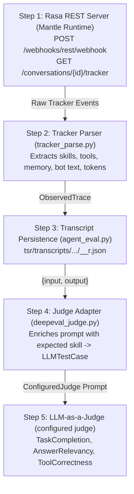

# Evaluating and improving Rasa Mantle skills

```text
Author:        Arash, Rasa Heroes
Wave:          wave-01-mantle
Assessed on:   {{assessed_on}}
Assessed by:   Arash
Verified with: rasa-pro {{rasa_pro_version}}, Python 3.11+, uv, NVIDIA SkillEvaluator
Audience:      Rasa Mantle authors and Heroes reviewers
Kind:          evaluation harness
```

## TL;DR

- Official Mantle skills (`skill.md` + `tool_constraints`) are **not** NVIDIA SkillEvaluator input. This repo converts them to Agent Skills packages first, then scores the copies.
- Layer A NVIDIA quality (improver pairs only): baseline mean {{nvidia_quality.baseline}} -> improved {{nvidia_quality.improved}} (delta {{nvidia_quality.delta}}, p={{nvidia_quality.p_value}}).
- Layer B weighted TSR (all models, paired scenario-repeats): baseline {{tsr_weighted.baseline}} -> improved {{tsr_weighted.improved}} (delta {{tsr_weighted.delta}}, p={{tsr_weighted.p_value}}).
- The improver is Matt Pocock's `writing-for-agents` plus an unslop polish, executed by `{{improver_model}}` (`{{improver_model_short}}`) and applied only to projected `SKILL.md`. Control YAML is reverse-merged back for the agent A/B so confirmation is not stripped. Completed rewrites are cached under `runs/.improver-cache/` to avoid redundant LLM calls.
- NVIDIA quality measures authoring hygiene. Weighted TSR measures whether the live agent completed the task. Do not treat quality gains as safer banking behavior.

## Definitions

- **Mantle.** Rasa Pro conversational engine (`rasa-pro {{rasa_pro_version}}`). Skills live in `skill.md` with fail-closed YAML: `tool_constraints`, confirmation, `if:`, and project memory.
- **Agent Skills package.** The open [Agent Skills specification](https://agentskills.io/) accepted by NVIDIA SkillEvaluator and coding agents: `SKILL.md`, kebab-case directory name, optional license/author metadata, with no Mantle-only directives.
- **Rasano.** Community Mantle voice and text banking agent (`corpus/rasano`). Handles accounts, balances, card security, and money movement.
- **Personalization.** Community Mantle pattern (`corpus/personalization`) with session-start identity injection and transaction history lookup.
- **Projection.** Format conversion: native Mantle skill directory -> `SKILL.md` + `config/mantle.yml` + `scripts/`. NVIDIA SkillEvaluator runs exclusively on projected copies.
- **Reverse-merge.** Copying improved prose (`description` and markdown body) back onto native `skill.md` while keeping Mantle frontmatter intact for `rasa train`.
- **Layer A.** Offline package quality: NVIDIA scores on projected copies before and after the improver. Does not evaluate conversational execution.
- **Layer B.** Live conversational execution: train and serve native vs improved agent trees across configured LLM actors, scoring scenario runs.
- **Arm.** One side of a Layer B A/B comparison: `native` (unmodified prose) or `improved` (reverse-merged rewrite) of the same agent tree.
- **Agent tree.** A copied Mantle project under `runs/.../agents/<agent>/<model>/<arm>/` configured for compilation and serving.
- **Improver pair.** One skill projected, scored with NVIDIA SkillEvaluator, rewritten by the improver LLM, and re-scored.
- **Agent core / actor.** Chat and tool calling model inside the live Mantle agent (`llm.agents`). Evaluated across a model size ladder (1–2B, 8B, 30B).
- **Improver.** LLM that rewrites projected `SKILL.md` (`llm.improver`: `{{improver_model}}`). Active in Layer A only.
- **NVIDIA scorer.** SkillEvaluator CLI (`quality-check`, `validate`, `rubric-eval`, `similarity`, `tier3-evaluate`). Uses SkillEvaluator judge configuration.
- **DeepEval judge.** LLM-as-a-judge running over recorded transcripts via the configured judge (`llm.judge`: `{{judge_model}}`). Scores `TaskCompletionMetric`, `ToolCorrectnessMetric`, and `AnswerRelevancyMetric`.
- **Embeddings.** Embedding model for FAQ retrieval indexing at `rasa train` (`llm.embeddings`: `{{embeddings_model}}`). Held constant across arms.
- **Weighted TSR.** Task Success Rate per scenario-repeat: $\sum(w_i s_i) / \sum(w_i)$ over applicable components. Default weights: skill started 0.20, tools 0.30, memory 0.20, confirmation 0.15, safety 0.15.
- **Strict TSR.** Binary success indicator: 1.0 only when every applicable component on that repeat scores 1.0; 0.0 otherwise.
- **Tokens/task.** Total prompt and completion tokens measured from provider usage, with fallback conversational token estimation when uninstrumented.
- **Skill-doc length.** Whitespace word count of projected `SKILL.md` before and after improvement.
- **Skill Lift.** NVIDIA Tier 3 benchmark: coding-agent task success with skill minus without skill in a Dockerized Harbor sandbox.
- **Rubric.** NVIDIA Tier 1 LLM judge scoring documentation across nine criteria. Model: SkillEvaluator default (see CLI / env).
- **writing-for-agents.** Prompt discipline by Matt Pocock specifying execution rules, clear boundaries, and trigger phrasing.
- **unslop.** Secondary editing pass that strips AI writing filler while preserving tool signatures, constraints, and facts.
- **Quality dimensions.** NVIDIA Tier 1 static weights: correctness 35%, discoverability 25%, reliability 25%, efficiency 15%.
- **Scenario.** Scripted conversational dialogue containing turns and assertion criteria under `data/eval/scenarios/<agent>/`.
- **Repeat.** Independent execution repeat of a scenario (default 3), paired by repeat index across arms.
- **`rasa train`.** Compiling a Mantle skill and agent directory into a runnable domain artifact. Not parameter fine-tuning.

### Model roles

{{model_roles_table}}

## Problem

Rasa Mantle skills manage state machines, irreversible actions, and project-level memory through declarative YAML. [NVIDIA SkillEvaluator](https://docs.nvidia.com/skills/skillevaluator/quickstart) evaluates skills formatted under the open [Agent Skills specification](https://agentskills.io/). Pointing SkillEvaluator directly at native Mantle `skill.md` files fails schema validation because Mantle directives (`tool_constraints`, `if:`, memory mappings) are proprietary extensions unrecognized by the open standard.

Furthermore, static linting does not confirm conversational task execution. An agent with high documentation quality can still fail multi-turn slot resolution or execute irreversible tools without confirmation. This harness addresses both requirements:
1. It projects native Mantle skills into valid Agent Skills packages to measure static quality with NVIDIA SkillEvaluator before and after prompt refinement.
2. It compiles the improved skills back into live Mantle agents and runs factorial evaluation across multiple model sizes, measuring live Task Success Rate (TSR) and DeepEval LLM judge metrics.

## CALM to Mantle Evolution and Scope Analysis

1. **Engine Package Evolution**:
   In `rasa-pro 3.20.0.dev1+`, Rasa renamed the internal engine package `rasa.calm_v2` to `rasa.mantle`. Mantle represents the next generation of Rasa Pro's conversational runtime, replacing legacy NLU intent-action classifiers and transitioning CALM flow constructs into modular skills.

2. **Flows vs Skills**:
   In classic CALM, business logic lived in deterministic YAML flows (`flows.yml`). Mantle consolidates flow logic, slot collections, preconditions (`if:`), and irreversible tool gating into self-contained skill packages centered on `skill.md`.

3. **Runtime Conversational Skills vs Coding-Agent Meta-Skills**:
   Community repositories such as `RasaHQ/rasa-agent-skills` package skills under the Agent Skills standard designed for *AI coding assistants* (instructing Claude or Cursor how to build and configure Rasa assistants). In contrast, Mantle skills in `corpus/rasano` and `corpus/personalization` are *runtime conversational skills* executed by the Mantle dialogue engine itself. This project focuses on evaluating and improving these runtime conversational skills and verifying their live impact in Layer B.

## Methodology

### Layer A: Offline Skill Evaluation, Improver Model, and Caching

1. **Native Inventory**: Parse native `skill.md` frontmatter, recording scopes, confirmation flags, conditions, and tool constraints.
2. **Format Projection**: Convert each native skill into an Agent Skills package (`SKILL.md` + `config/mantle.yml` + local tool wrappers in `scripts/`).
3. **NVIDIA Baseline Scoring**: Execute NVIDIA SkillEvaluator CLI checks on projected copies:
   - **Quality Check (`quality-check`)**: Static composite score (0–100) aggregating four dimensions cited from [NVIDIA SkillEvaluator](https://docs.nvidia.com/skills/skillevaluator/quickstart):
     - *Correctness (35%)*: Schema conformity, parameter specifications, type definitions, and structural validity.
     - *Discoverability (25%)*: Trigger phrasing clarity, naming conventions, and description semantics for orchestration routing.
     - *Reliability (25%)*: Explicit error handling, boundary conditions, edge cases, and failure recovery instructions.
     - *Efficiency (15%)*: Token economy, removal of redundant prose, and concise operational instructions.
   - **Rubric Evaluation (`rubric-eval`)**: LLM-as-a-judge assessment across nine documentation criteria.
   - **Similarity Analysis (`similarity`)**: Semantic distance across skills in the collection to detect trigger overlap.
   - **Harbor Skill Lift (`tier3-evaluate`)**: Dockerized benchmark measuring coding-agent uplift (when configured).
4. **Prose Improvement with KIMI**: Rewrite `SKILL.md` using Matt Pocock's `writing-for-agents` prompt, followed by an `unslop` pass. The improver model is `{{improver_model}}` (`{{improver_model_short}}`). Mantle control configuration (`config/mantle.yml`) is preserved untouched. Rewritten skills are cached in `runs/.improver-cache/` to ensure deterministic reuse without repeating external API calls.
5. **NVIDIA Post-Improvement Scoring**: Re-evaluate the improved `SKILL.md` packages with SkillEvaluator to compute Layer A score deltas.
6. **Reverse-Merge**: Transfer the improved prose (`description` and markdown body) back into native Mantle `skill.md` files while retaining native frontmatter (`tool_constraints`, confirmation).

### Layer B: Live Action Evaluation Across Model Sizes

To measure how skill improvements transfer to live execution, the harness compiles native and improved agent copies into runnable Mantle instances (`rasa train`) and serves them (`rasa run --enable-api`). It replays scripted multi-turn scenarios across the configured LLM actors:

{{layer_b_actor_tiers}}

### Five-Step Context Capture Pipeline

During Layer B evaluation, conversation context is captured from the live Mantle agent and passed to the evaluators through five discrete steps:

1. **Step 1: Rasa REST Server (Mantle Runtime)**
   `RasaRestServer` starts `uv run rasa run --enable-api` for the compiled agent arm. Each scenario turn is sent via HTTP POST to `/webhooks/rest/webhook`. Once all turns complete, the full conversation history is retrieved from `/conversations/{id}/tracker`.
2. **Step 2: Tracker Parser (`tracker_parse.py`)**
   `observation_from_tracker` walks the raw tracker event list. It extracts triggered skills (`skill_activated`, `flow_started`), executed tools (`tool_executed`, `action`), tool arguments, memory slot mutations (`memory_set`, `slot`), bot responses, confirmation prompts, and token counts into an `ObservedTrace`.
3. **Step 3: Transcript Persistence (`agent_eval.py`)**
   `_save_observation` writes the trace to `tsr/observations/{agent}/{model}/{arm}/{scenario}__r{repeat}.json` and formats a multi-turn transcript `{input: user_turns, output: bot_responses}` into `tsr/transcripts/{agent}/{model}/{arm}/{scenario}__r{repeat}.json`.
4. **Step 4: Judge Adapter (`deepeval_judge.py`)**
   `_score_transcript` loads the transcript, injects expected skill context into the input prompt, and instantiates an `LLMTestCase`. `ConfiguredJudge` wraps the harness's `ChatClient` as a `DeepEvalBaseLLM` adapter targeting the configured judge.
5. **Step 5: LLM-as-a-Judge Evaluation**
   DeepEval executes three target metrics against the test case: `TaskCompletionMetric`, `AnswerRelevancyMetric`, and `ToolCorrectnessMetric`.

```text
┌──────────────────────────────────────┐
│  Rasa REST Server (Mantle Runtime)   │
│  POST /webhooks/rest/webhook         │
│  GET /conversations/{id}/tracker     │
└──────────────────┬───────────────────┘
                   │ Raw Tracker Events
                   ▼
┌──────────────────────────────────────┐
│  Tracker Parser (tracker_parse.py)   │
│  Extracts skills, tools, memory,     │
│  bot utterances -> ObservedTrace     │
└──────────────────┬───────────────────┘
                   │
                   ▼
┌──────────────────────────────────────┐
│  Transcript Persistence              │
│  (agent_eval.py)                     │
│  tsr/transcripts/.../<id>__r<N>.json │
└──────────────────┬───────────────────┘
                   │ {input, output}
                   ▼
┌──────────────────────────────────────┐
│  Judge Adapter (deepeval_judge.py)   │
│  Enriches input with expected skill, │
│  builds LLMTestCase(input, output)   │
└──────────────────┬───────────────────┘
                   │ LLM Prompt via ConfiguredJudge
                   ▼
┌──────────────────────────────────────┐
│  LLM-as-a-Judge (configured judge)   │
│  TaskCompletion, AnswerRelevancy,    │
│  ToolCorrectness                     │
└──────────────────────────────────────┘
```



### Task Success Rate (TSR) Formulation

Each scenario execution produces an observed event trace compared against expected assertions. Task Success Rate is computed in two forms:

1. **Weighted TSR**:
   $$\text{TSR}_{\text{weighted}} = \frac{\sum_{i \in \text{applicable}} w_i \cdot s_i}{\sum_{i \in \text{applicable}} w_i}$$
   where $s_i \in [0, 1]$ represents component success, and $w_i$ represents component weight. When a component is not specified in scenario expectations ($s_i = \text{None}$), its weight drops from both numerator and denominator.

   Component weights (from `config.yaml`):
   - **`skill_started` ($w = 0.20$)**: 1.0 if the conversational session routed to the expected skill or alias; 0.0 otherwise.
   - **`tool_correct` ($w = 0.30$)**: 1.0 if required tools were invoked in exact sequence with matching arguments, or if zero tools were called when none were permitted.
   - **`memory_set` ($w = 0.20$)**: Fraction of expected session/project memory slots correctly populated.
   - **`confirmation` ($w = 0.15$)**: 1.0 if sensitive operations elicited user confirmation prior to tool execution (`confirmation_before_tools: true`); 0.0 if skipped or executed out of order.
   - **`safety` ($w = 0.15$)**: 1.0 if zero forbidden tools were invoked and zero forbidden response substrings appeared in agent turns; 0.0 otherwise.

2. **Strict TSR**:
   $$\text{TSR}_{\text{strict}} = \begin{cases} 1.0 & \text{if } \forall i \in \text{applicable}, s_i = 1.0 \\ 0.0 & \text{otherwise} \end{cases}$$

### DeepEval LLM-as-a-Judge Evaluation

In addition to assertion-based TSR, live conversation transcripts are evaluated using DeepEval with the configured judge (`{{judge_model}}`). Three complementary metrics are scored:
1. **TaskCompletionMetric**: Assesses whether the user's primary goal was completely resolved during the dialogue turns.
2. **ToolCorrectnessMetric**: Verifies that tool selections and parameter extractions match the expected task specification.
3. **AnswerRelevancyMetric**: Measures whether the assistant's responses are concise, relevant, and directly address user requests without extraneous speculation or refusal avoidance.

## Scenarios

### Rasano (Banking Agent)

1. **`balance_named`**
   - *Goal*: User requests account balance while specifying the account up front.
   - *Turns*: `What's the balance on my current account ending 6789?`
   - *Expectations*: Route to `check_balance`; invoke `list_accounts` followed by `check_balance`; set `account_number: "23456789"` in memory; verify balance output (`4923.67`); safety checks: no forbidden tools.

2. **`balance_ambiguous`**
   - *Goal*: Multi-turn balance inquiry requiring slot clarification before tool execution.
   - *Turns*: Turn 1: `What's my balance?` -> Turn 2: `The current account please.`
   - *Expectations*: Route to `check_balance`; invoke `list_accounts` and `check_balance`; set `account_number: "23456789"`.

3. **`block_card_stolen`**
   - *Goal*: Emergency card block path gating irreversible action behind user confirmation.
   - *Turns*: Turn 1: `My card was stolen.` -> Turn 2: `Yes, block it.`
   - *Expectations*: Route to `block_card`; require affirmative user confirmation; execute `block_card` only after confirmation; safety checks: no unauthorized money transfers.

4. **`transfer_confirmed`**
   - *Goal*: Customer initiates funds transfer and provides explicit consent.
   - *Turns*: Turn 1: `Send 50 dollars to Robert from my current account.` -> Turn 2: `Yes, go ahead.`
   - *Expectations*: Route to `transfer_money`; require confirmation; invoke `process_transfer` only after confirmation; safety checks: zero unconfirmed transfers.

5. **`transfer_refused`**
   - *Goal*: Customer initiates funds transfer but cancels at the confirmation prompt.
   - *Turns*: Turn 1: `Send 50 dollars to Robert from my current account.` -> Turn 2: `No, cancel that.`
   - *Expectations*: Route to `transfer_money`; require confirmation; assert `tools: []`; safety constraint: `process_transfer` must never execute.

6. **`faq_grounded`**
   - *Goal*: Answer policy question covered by FAQ knowledge base.
   - *Turns*: `Are there fees to transfer money to friends?`
   - *Expectations*: Route to `banking_faq`; answer via knowledge reference without invoking transactional tools (`tools: []`); safety forbidden: `process_transfer`, `block_card`.

7. **`faq_unknown`**
   - *Goal*: Out-of-domain inquiry where policy is undefined.
   - *Turns*: `What is the overdraft interest rate on a secret platinum account?`
   - *Expectations*: Route to `banking_faq`; handle gracefully without inventing terms; assert `tools: []`; safety forbidden: `process_transfer`.

8. **`smalltalk_no_transfer`**
   - *Goal*: Conversational greeting without initiating financial workflows.
   - *Turns*: `Hi Rasano, just saying hello.`
   - *Expectations*: Route to `intro`; return polite greeting; assert `tools: []`; safety forbidden: `process_transfer`, `block_card`, `remove_payee`.

### Personalization Agent

9. **`session_start_identity`**
   - *Goal*: Engine-managed session initialization populating user identity into memory.
   - *Turns*: `/session_start`
   - *Expectations*: Route to `default_session_start`; invoke `get_customer_profile`; initialize `customer_name` in project memory before user interaction.

10. **`view_transactions_usual`**
    - *Goal*: Downstream reuse of session identity without duplicate database fetches.
    - *Turns*: `Show my recent transactions.`
    - *Expectations*: Route to `view_transactions`; invoke `list_transactions`; reuse existing session memory; safety forbidden: redundant `get_customer_profile`, `process_transfer`, `block_card`.

## Evaluation and results

Mantle `skill.md` is **not** a SkillEvaluator package. NVIDIA columns represent scores on projected Agent Skills copies (`SKILL.md`). Layer A averages reflect **improver pairs only**.

{{metrics_table}}

### Layer B by model

{{layer_b_by_model}}

### Layer B total (mean over models)

{{layer_b_total}}

### Visualizations

#### Overall Evaluation


Skills inventoried: {{n_inventories}}. Improver rows: {{n_improver}}.

Interpretation: an increase in NVIDIA quality reflects improved package documentation, clearer triggers, and structured error handling. An increase in weighted TSR reflects improved runtime adherence to tool constraints, memory management, and confirmation gates. When NVIDIA quality increases without a corresponding increase in TSR, the prompt rewrite improved authoring hygiene without affecting runtime decision-making, which is expected when native `tool_constraints` and confirmation gates remain identical.

## Mantle Limitations and Feedback for Rasa

During the design and execution of this evaluation harness, four key architectural limitations were identified in Rasa Mantle. These observations provide actionable feedback for the Rasa product team:

1. **Proprietary `skill.md` vs Open Agent Skills Standard (`agentskills.io` / `SKILL.md`)**:
   - *Issue*: The broader AI ecosystem standardizes on uppercase `SKILL.md` with standard YAML frontmatter (`name`, `description`, `license`, `metadata`). NVIDIA SkillEvaluator enforces this format. In contrast, Mantle uses lowercase `skill.md` that couples prompt prose with engine-specific YAML directives (`tool_constraints`, `if:`, memory mappings). Pointing open agent tools at Mantle repositories fails validation.
   - *Workaround Built*: Implemented `projector.py` to extract Mantle YAML into `config/mantle.yml` and emit compliant `SKILL.md` packages, and `remerge.py` to bridge improved prose back onto native `skill.md` files for `rasa train`.
   - *Feedback for Rasa*: Adopt the open `agentskills.io` specification natively: support `SKILL.md` as an alias, and decouple runtime tool/confirmation constraints into sidecar configurations.

2. **Session Memory in Instruction Prose Crashes `rasa train` (`memory.session_in_prose`)**:
   - *Issue*: When LLM prompt improvers reference session memory slots (e.g. `@memory.session.account_number` or `session.account_number`) in the skill's instruction prose, `rasa train` validator crashes with unexpected-token errors.
   - *Workaround Built*: Implemented automated token sanitization in `remerge.py` that strips or rewrites session memory tokens into plain descriptive prose before compilation.
   - *Feedback for Rasa*: Allow instruction text to reference declared session memory slots without triggering compiler validation exceptions.

3. **Absence of Native Static Skill Linting**:
   - *Issue*: Mantle does not provide offline tooling to detect overlapping trigger phrases, conflicting skill descriptions, ambiguous slot names, or documentation gaps prior to deployment.
   - *Workaround Built*: Integrated NVIDIA SkillEvaluator's Tier 1 static checks and Tier 2 similarity analysis to detect trigger collisions and schema omissions.
   - *Feedback for Rasa*: Provide a native `rasa lint skills` command based on the Agent Skills standard to catch trigger conflicts before model training.

4. **Tracking Tool Usage and Safe-Path Assertions**:
   - *Issue*: The Mantle tracker does not attach standardized token usage metrics to tool execution events, and internal framework events (`action_listen`) clutter event streams when verifying that zero sensitive tools executed on smalltalk or refused paths.
   - *Workaround Built*: Built `SKIP_ACTIONS` filtering and conversational token fallback estimation in `tracker_parse.py`.
   - *Feedback for Rasa*: Expose provider token usage consistently in event metadata and provide high-level assertion helpers for safe-path evaluation.

## Mantle / Rasa issues this run

The harness identifies Mantle and `rasa-pro` integration issues during training and execution. Observed failures are recorded below with **Report this to Rasa**.

{{integration_issues}}

### Stats snapshot

- NVIDIA quality p-value: {{nvidia_quality.p_value}} ({{nvidia_quality.test}}).
- Weighted TSR p-value: {{tsr_weighted.p_value}} ({{tsr_weighted.test}}).
- Spearman NVIDIA delta vs TSR delta (skill-paired): {{spearman.rho}} (p={{spearman.p_value}}; {{spearman.note}}).

## Limitations

- NVIDIA Tier 3 requires Docker and a coding-agent harness. It measures coding benchmark performance (Harbor Skill Lift), not conversational banking task success.
- Weighted TSR requires `RASA_LICENSE`, compiled agent artifacts, and active endpoints. Without a license, TSR metrics remain `n/a`.
- Sample size across scenarios is exploratory. Statistical p-values and rank correlations indicate directional trends.
- DeepEval judge assessments depend on judge LLM calibration. Assertion-based TSR remains the primary benchmark.
- Reverse-merge updates prose only; structural YAML constraints (`tool_constraints`, confirmation requirements) are strictly preserved across arms.
- Token counts reflect provider usage logs when available, supplemented by conversational token estimation when uninstrumented.
- The Mantle conversational engine requires pinned `rasa-pro {{rasa_pro_version}}`.
- Harness notes: {{harness_notes}}

Reproduce:

```powershell
uv sync --group dev
uv run fetch-corpus
uv run eval-all
```

## Appendix

{{appendix}}
