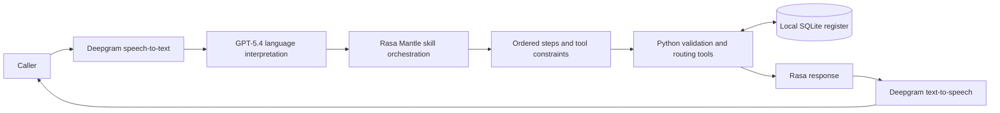

# Civico

> A voice-first civic complaint assistant that turns an unstructured call into a validated, routed, and trackable report.

```text
Author:        Samaksh Mehra
Wave:          wave-01-mantle
Assessed on:   2026-09-18
Assessed by:   Samaksh Mehra
Verified with: rasa-pro 3.20.0.dev6, Python 3.12, uv
Audience:      Builders evaluating reliable voice intake with Rasa Mantle
Time:          15–20 minutes to install and run after keys are available
```

Built for Rasa Heroes Wave 01 on the Mantle engine.

## What it does

Civico demonstrates a municipal complaint line for callers who may describe a
problem naturally, provide details out of order, correct themselves, or be
unsure of their ward. It accepts six types of report: potholes, garbage, water
supply, streetlights, drainage, and stray animals.

The agent can:

- collect the problem, locality or PIN code, exact landmark, and callback number;
- match the locality to a fictional ward directory and assign the demo team;
- detect a possible duplicate and let the caller join it or create a new report;
- read the complete report back before any write;
- create a stable complaint reference in SQLite;
- look up a complaint by reference or, with consent, by callback number;
- escalate only when the stored target date has passed;
- answer routing and process questions; and
- provide an honest handoff path when a live transfer is unavailable.

This is a local demonstration, not an official municipal service. Localities
and PIN codes are real enough to make the scenario understandable, but ward
numbers, officers, phone numbers, departments, deadlines, and dispatches are
fictional.

## Why this is a Mantle use case

A complaint call needs both flexible language understanding and predictable
business rules. Civico separates those responsibilities:

- **The LLM** understands the caller's words, selects an appropriate skill, and
  proposes structured tool calls.
- **Mantle** keeps conversation state, follows ordered blocks, and enforces
  tool prerequisites and confirmation gates.
- **Python tools** validate categories, phone numbers, locations, duplicate
  candidates, dates, and database writes.
- **SQLite** stores complaint state so a later call can retrieve or escalate it.

The LLM can understand “the bulb outside my society has stopped working,” but
it cannot invent a ward, officer, deadline, or reference number. Those values
must come from deterministic data and tools.

## End-to-end architecture



Text conversations use the same path without speech-to-text or text-to-speech.
The REST channel is available for scripted demonstrations and integrations.

## Complaint-reporting flow

1. **Recognise the task.** A request such as “I want to report a problem”
   activates `report_problem`, even before the category is known.
2. **Collect facts naturally.** The caller can provide details in any order.
   Civico saves everything useful and asks one question at a time only for what
   is still missing.
3. **Validate the problem.** The tool layer normalises the description to one
   of the six supported categories. Unsupported issues are not forced into a
   wrong category.
4. **Route the area.** The locality or PIN code is matched against the bundled
   ward directory. A unique match is reviewed in the final summary; an
   ambiguous match is clarified in plain language. After two unsuccessful
   attempts, the report can still go to the general grievance cell.
5. **Capture the exact spot.** A building, road, gate, shop, or public landmark
   is stored verbatim for the work order. A PIN code alone is not treated as an
   exact incident location.
6. **Check possible duplicates.** Open reports with the same category and ward
   are candidates. The caller decides whether the existing incident is the
   same issue or a different spot; the model never makes that decision alone.
7. **Review and confirm.** Civico reads one complete summary. Rasa's
   `requires_confirmation` gate prevents the database write until the caller
   explicitly approves it.
8. **Save and return a reference.** A successful tool write creates a complaint
   ID, department, target date, and demo assignment. If the write fails, the
   agent says that the report was not saved.

Corrections do not restart the conversation. Changing the category, area,
landmark, description, or callback number invalidates the previous review and,
where needed, reruns routing and duplicate checks before a fresh confirmation.

## Skills

| Skill | Control style | Responsibility |
|---|---|---|
| `default_session_start` | Engine-managed ordered block | Load the demo caller and greet. |
| `report_problem` | Ordered block | Collect, validate, route, check duplicates, confirm, and save. |
| `check_status` | Ordered block | Find a report and conditionally offer escalation. |
| `escalate` | Ordered block | Recheck eligibility and raise an overdue complaint. |
| `who_handles_this` | Ordered block | Read the responsible demo team and offer to file. |
| `civic_faq` | Knowledge-backed | Answer general questions from bundled references. |
| `human_handoff` | Autonomous | Explain the demo handoff boundary without claiming a transfer. |
| `goodbye` | Autonomous | End the call briefly. |

The ordered skills are used where sequence and side effects matter. The
autonomous skills are intentionally small and conversational.

## Location and routing design

Civico does not call OpenStreetMap or another live geocoder. Routing only needs
to answer “which demo work queue owns this area?”, so the project uses a bounded
directory in [`data/wards.json`](data/wards.json): 29 locality rows across 14
fictional wards, with aliases and PIN codes.

This makes the demo offline, reproducible, fast, and easy to test. It also keeps
two different kinds of location separate:

- **Locality or PIN code** selects a demo ward and officer.
- **Landmark or exact spot** tells the field team where the incident is.

For a real deployment, the same tool boundary could be connected to an official
municipal GIS or ward service without redesigning the conversation flow.

## Supported categories

| Category | Demo department | Target |
|---|---|---:|
| `pothole` | Road Maintenance | 7 days |
| `garbage` | Sanitation | 2 days |
| `water_supply` | Water Services | 3 days |
| `streetlight` | Street Lighting | 3 days |
| `drainage` | Drainage | 5 days |
| `stray_animals` | Animal Care | 5 days |

These targets are fictional and exist only to demonstrate routing, status, and
time-based escalation.

## Run from a fresh clone

### Requirements

- macOS or Linux
- Python 3.11–3.13 (verified with Python 3.12)
- [`uv`](https://docs.astral.sh/uv/)
- a Rasa Pro Developer Edition licence in `RASA_LICENSE`
- an OpenAI API key in `OPENAI_API_KEY`
- a Deepgram API key in `DEEPGRAM_API_KEY` for voice

### Install and configure

```bash
make install
make env
```

Open `.env` and fill in the three required values. Never commit that file.
Then run the preflight checks and offline tests:

```bash
make verify
make test
```

### Start the voice and text Inspector

```bash
make train
make inspect
```

`make train` validates and packages the skills; it does **not** train GPT or a
new language model. `make inspect` opens Rasa Inspector for microphone or text
testing.

### Start the REST API

```bash
make run
```

The local Rasa API runs on `http://localhost:5007`. In another terminal, replay
a scripted conversation:

```bash
make demo-call ARGS=natural
```

Other scripted cases are listed by `make demo-call ARGS=--help` and in
[`DEMO.md`](DEMO.md).

## Quick demonstration

After `make inspect`, try this normal report:

1. “I want to report garbage bags left outside the Juniper School gate in Indirapuram.”
2. “Use nine zero zero zero zero zero zero zero zero one for follow-up.”
3. If asked about an existing incident, answer whether it is the same place.
4. At the final confirmation, say “Yes, file it.”
5. Then ask, “What is the status of that complaint?”

Useful edge cases:

- Say “Actually, it is at the park gate opposite the school” during review to
  show correction and revalidation.
- Report drainage in Vaishali to exercise the seeded duplicate path.
- Look up `CIV1002` to demonstrate a genuinely overdue complaint and escalation.
- Give an unknown locality twice to show fallback to the grievance cell instead
  of abandoning the caller.
- Run `make demo-failure` to demonstrate an honest failed-write response.

## Testing and reproducibility

The repository contains 151 offline regression tests covering directory
matching, spoken digits, category validation, complaint IDs, duplicate support,
corrections, consent gates, status, escalation, persistence, and failure paths.

```bash
make test       # offline Python regression suite
make verify     # environment, project, skills, and seed-data checks
make train      # Rasa validation and model packaging
```

Conversation scenarios live under [`eval/`](eval/). They use LLM-based callers
and judges, so repeated runs are more meaningful than a single score. The
offline suite is deterministic; microphone, ASR, TTS, and end-of-turn timing
still require a manual voice pass.

## Data lifecycle and privacy

The tracked JSON files in [`data/`](data/) contain fictional seed records. On
the first tool call they create `data/civico.db`, which holds mutable reports.
The generated database is ignored by Git and is not part of the submission.

```bash
make show-demo-data  # inspect the fictional seeds
make reset-db        # remove runtime state; next tool call reseeds it
```

Use only demo callback numbers when recording or sharing output. Secrets belong
in `.env`; only empty placeholders are committed in `.env.example`.

## Project structure

```text
agent.yml          Persona, safety rules, and voice settings
integrations.yml   GPT-5.4 orchestration, REST/Inspector, Deepgram ASR/TTS
endpoints.yml      GPT-5-nano response rephrasing and embeddings
memory.yml         Session-level caller identity
skills/            Eight Mantle skills and their scoped memory/tools
tools/             Shared caller, status, and escalation tools
lib/               Ward matching, speech normalisation, paths, and SQLite store
data/              Fictional routing, wards, callers, and complaint seeds
tests/             Deterministic offline regression suite
eval/              LLM-driven conversation scenarios
scripts/           Setup checks, scripted calls, data display, quality report
```

## Design choices worth reviewing

- **Business facts come from tools.** The model interprets language but cannot
  manufacture IDs, routing, officers, targets, or database results.
- **Side effects are gated twice.** Ordered flow state must be complete, and
  Rasa requires explicit submission confirmation before a write.
- **Duplicate detection is assisted, not automatic.** The system finds a
  candidate; the caller decides whether it is the same incident.
- **Caller-ID lookup requires consent.** A status request alone does not expose
  the complaint history associated with the calling number.
- **Failure remains a valid outcome.** Unknown locations route to a general
  cell, unsupported categories are explained, and failed writes are not
  represented as successful submissions.

## Known rough edges

- Voice has had less coverage than the deterministic text/tool paths and needs
  a fresh end-to-end microphone pass before a live demonstration.
- Duplicate candidates use category plus ward, so they are intentionally broad;
  the caller must confirm whether the incident is actually the same.
- The FAQ/reference interaction can leave an unnecessary resume prompt in the
  current beta engine.
- Some LLM turns may announce an action before performing it, adding latency to
  a voice conversation despite the project instruction to avoid that pattern.
- Routing, deadlines, persistence, and human handoff are demo implementations;
  no complaint is sent to a real authority and no live transfer occurs.
- The current voice configuration is English-only.

The build notes and concrete Mantle observations are documented in
[`FINDINGS.md`](FINDINGS.md). Recording steps are in [`DEMO.md`](DEMO.md),
and the acceptance scenarios are in
[`PRODUCT_ACCEPTANCE.md`](PRODUCT_ACCEPTANCE.md).

## License

When submitted under `RasaHQ/rasa-community-resources`, this project is covered
by that repository's Apache License 2.0. Rasa Pro remains commercial software
under its own licence terms.
